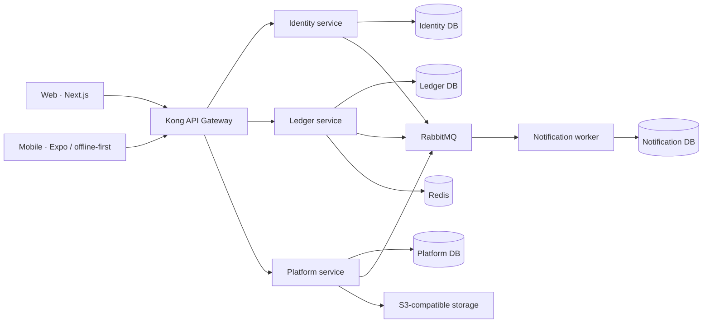

# Kiến trúc đề xuất cho Equa V1

## 1. Kết luận

Đội 5 người nên bắt đầu với **4 deployable backend** thay vì một service cho mỗi danh từ trong SRS.
Ranh giới vẫn là microservice thật (API/event và dữ liệu riêng), nhưng các nghiệp vụ cần transaction
chặt được đặt cùng một context. Khi tải hoặc đội ngũ tăng, module bên trong có thể tách ra dựa trên số
liệu vận hành.

## 2. Stack đã chọn

| Lớp              | Lựa chọn                             | Lý do                                                                        |
| ---------------- | ------------------------------------ | ---------------------------------------------------------------------------- |
| Runtime          | Node.js 24 LTS + TypeScript          | Một ngôn ngữ cho Web/Mobile/BE, giảm tải nhận thức cho 5 dev                 |
| Monorepo         | pnpm workspaces + Turborepo          | Cài đặt có lockfile chung, cache build, thay đổi contract đồng bộ            |
| Web              | Next.js App Router                   | TypeScript, SSR/CSR linh hoạt, Docker deploy được                            |
| Mobile           | Expo + React Native                  | Một codebase iOS/Android, hỗ trợ dev build/EAS, phù hợp offline-first        |
| Backend          | NestJS + Fastify                     | Module rõ, DI/test tốt, phù hợp API và worker                                |
| Gateway          | Kong Gateway CE DB-less              | Route/rate limit/request size/correlation ID bằng config lưu trong Git       |
| Dữ liệu chính    | PostgreSQL 18                        | Transaction, constraint, index và full-text search phù hợp dữ liệu tài chính |
| Cache/rate limit | Redis 8                              | Cache có TTL, distributed counter, idempotency cache ngắn hạn                |
| Event bus        | RabbitMQ 4.3                         | Routing/retry/DLQ dễ vận hành hơn Kafka ở quy mô MVP                         |
| Object storage   | S3-compatible (MinIO chỉ dùng local) | Receipt/avatar private, signed URL; production dùng managed object storage   |
| Telemetry        | OpenTelemetry + Prometheus starter   | Chuẩn vendor-neutral; profile local có thể bật khi cần                       |

Tiền phải lưu bằng **minor unit dạng integer/BigInt**, kèm currency ISO 4217; không dùng JavaScript
`number` cho phép tính tiền. Transaction ghi dữ liệu tài chính và outbox event phải cùng một PostgreSQL
transaction.

## 3. Bounded context và database ownership

| Deployable            | Sở hữu                                                                                               | Database            | Không được làm                                          |
| --------------------- | ---------------------------------------------------------------------------------------------------- | ------------------- | ------------------------------------------------------- |
| `identity-service`    | credential/session, profile, privacy/export/delete orchestration                                     | `equa_identity`     | Không giữ group/expense                                 |
| `ledger-service`      | friendship, group/member, expense/split, recurring, balance, debt view, settlement, sync log, outbox | `equa_ledger`       | Không gọi payment provider trực tiếp                    |
| `platform-service`    | subscription/entitlement, payment adapter, currency/rate, receipt/OCR draft, feature flag/admin      | `equa_platform`     | Không cập nhật bảng balance/expense                     |
| `notification-worker` | delivery attempt, template/channel status, idempotency                                               | `equa_notification` | Không chặn transaction nghiệp vụ chính khi provider lỗi |

`Expense + Split + Balance + Settlement` cố ý ở chung Ledger trong V1. Tách chúng thành các database
khác nhau sẽ biến một invariant tài chính đơn giản thành distributed transaction. Khi cần scale, ưu tiên
tách read model/analytics trước, không tách write model tài chính trước.

## 4. Giao tiếp

- Client → Gateway: REST/HTTPS `/v1/*`; WebSocket chỉ thêm khi có use case realtime thật.
- Đồng bộ service-to-service: REST nội bộ khi response hiện tại bắt buộc phải chờ; timeout 3 giây,
  không tạo chuỗi gọi dài.
- Bất đồng bộ: RabbitMQ topic exchange, event có `eventId`, `type`, `version`, `occurredAt`,
  `correlationId`, `producer`, `payload`.
- Mỗi consumer lưu inbox/idempotency key; retry có exponential backoff; vượt ngưỡng vào DLQ.
- Contract thay đổi tương thích ngược; event có version. Không chia sẻ ORM entity qua `packages/`.

## 5. API Gateway

Kong chạy DB-less và nhận cấu hình từ `infra/kong/kong.yml`. Local scaffold đã bật correlation ID,
CORS local, request limit 5 MiB và rate limit qua Redis. Upload receipt 10–15 MiB phải có route/plugin
riêng khi Receipt API được tạo, không nới global limit.

Local pin Community Edition `3.9.3-ubuntu`; xem `infra/kong/README.md`. Trước production phải quyết
định rõ CE hay licensed Kong/Konnect và pin exact image digest, không suy từ tài liệu Enterprise mới
hơn sang image CE.

JWT verification chưa được bật vì Identity chưa có signing key/issuer thật. Khi triển khai auth:

1. Identity ký RS256/ES256 bằng key trong secret manager, public key công bố qua JWKS.
2. Gateway verify signature, issuer, expiry và audience; service vẫn kiểm tra resource ownership.
3. Key rotation phải chấp nhận key cũ và mới trong thời gian chuyển tiếp.
4. Login/signup/reset có rate limit riêng thấp hơn global limit.

Không dùng Kong Admin API công khai. Port 8001 chỉ bind loopback trong local; production tắt hoặc đặt
trong private management network.

## 6. Topology môi trường

### Local

App chạy native để hot reload; Postgres/Redis/RabbitMQ/MinIO/Mailpit/Kong chạy Compose. Một PostgreSQL
container chứa bốn logical database để tiết kiệm RAM. Đây không phải topology production.

### Staging/production khuyến nghị

| Khối           | Đặt ở đâu                        | Gợi ý                                                           |
| -------------- | -------------------------------- | --------------------------------------------------------------- |
| Edge/API       | Load balancer/WAF + Kong         | Chỉ 80/443 public; ít nhất 2 replica khi có user thật           |
| App compute    | Container service/VM private     | Web + 3 services + worker; stateless                            |
| PostgreSQL     | Managed PostgreSQL               | Ban đầu một instance, 4 database + 4 role riêng; PITR và backup |
| Redis          | Managed Redis                    | Private network, TLS/auth, eviction policy rõ                   |
| RabbitMQ       | Managed RabbitMQ hoặc VM private | Durable queue, DLQ, monitoring disk/memory/backlog              |
| Receipt/avatar | Managed S3-compatible bucket     | Private bucket, encryption, lifecycle, signed URL               |
| Secrets        | Cloud secrets manager            | Workload identity, không copy `.env` bằng tay                   |

Nếu ngân sách chỉ cho phép đúng **2 server**:

- Server 1 (public app plane): TLS/load balancer, Kong, Web, services, worker.
- Server 2 (private data plane): PostgreSQL + Redis + RabbitMQ; firewall chỉ nhận từ Server 1; backup
  đẩy ra object storage ngoài server.

Đây chỉ là topology demo/MVP và có single point of failure. Khi có người dùng thật, ưu tiên chuyển
PostgreSQL sang managed service trước khi mua thêm server. Kubernetes chưa cần cho V1.

## 7. Tiêu chí tách service sau này

Chỉ tách khi có ít nhất một bằng chứng: cần scale độc lập rõ rệt, ownership thuộc team khác, chu kỳ
release độc lập gây nghẽn, yêu cầu bảo mật/cô lập riêng, hoặc database load chứng minh ranh giới hiện tại
không đáp ứng. Analytics/search là ứng viên tách trước; financial write path là ứng viên tách sau.
