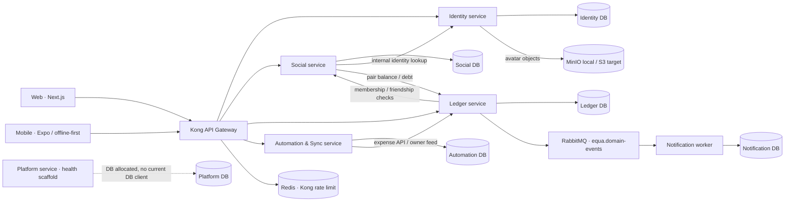

# Kiến trúc đề xuất cho Equa V1

## 1. Kết luận

Runtime hiện có **4 product-facing backend services** (`identity`, `social`, `ledger`,
`automation-sync`), **1 Platform health scaffold**, và **1 notification worker**. Web và
Mobile là client; `packages/contracts` là shared package. Đây là inventory runtime,
không đồng nghĩa mọi product API của từng component đã hoàn tất.

```mermaid
flowchart LR
  Web["Web · Next.js"] --> GW["Kong API Gateway"]
  Mobile["Mobile · Expo / offline-first"] --> GW
  GW --> Identity["Identity service"]
  GW --> Social["Social service"]
  GW --> Ledger["Ledger service"]
  GW --> Auto["Automation & Sync service"]
  Platform["Platform service · health scaffold"]
  Identity --> IDDB[("Identity DB")]
  Social --> SDB[("Social DB")]
  Ledger --> LDB[("Ledger DB")]
  Auto --> ADB[("Automation DB")]
  Platform -. "DB allocated, no current DB client" .-> PDB[("Platform DB")]
  Social -->|"internal identity lookup"| Identity
  Social -->|"pair balance / debt"| Ledger
  Ledger -->|"membership / friendship checks"| Social
  Auto -->|"expense API / owner feed"| Ledger
  Ledger --> Bus["RabbitMQ · equa.domain-events"]
  Bus --> Notify["Notification worker"]
  Notify --> NDB[("Notification DB")]
  GW --> Redis[("Redis · Kong rate limit")]
  Identity -->|"avatar objects"| Objects[("MinIO local / S3 target")]
```

Internal service calls use HTTP adapters and service-key headers directly between
configured service URLs. They do not use public Kong routes or another service's
database. The web Local Demo stores demo-domain state in browser `localStorage`; it
is not backend persistence.

## 2. Stack đã chọn

| Lớp                | Lựa chọn                                                                     | Lý do                                                                               |
| ------------------ | ---------------------------------------------------------------------------- | ----------------------------------------------------------------------------------- |
| Runtime            | Node.js 24 LTS + TypeScript                                                  | Một ngôn ngữ cho Web/Mobile/BE, giảm tải nhận thức cho 5 dev                        |
| Monorepo           | pnpm workspaces + Turborepo                                                  | Cài đặt có lockfile chung, cache build, thay đổi contract đồng bộ                   |
| Web                | Next.js App Router                                                           | TypeScript, SSR/CSR linh hoạt, Docker deploy được                                   |
| Mobile             | Expo + React Native                                                          | Một codebase iOS/Android, hỗ trợ dev build/EAS, phù hợp offline-first               |
| Backend            | NestJS + Fastify ở Identity/Platform; Fastify ở Social/Ledger/Automation     | Phù hợp framework đang dùng trong từng component                                    |
| Gateway            | Kong Gateway CE DB-less                                                      | Route/rate limit/request size/correlation ID bằng config lưu trong Git              |
| Dữ liệu chính      | PostgreSQL 18                                                                | Transaction, constraint, index và full-text search phù hợp dữ liệu tài chính        |
| Gateway rate limit | Redis 8                                                                      | Redis hiện được Kong dùng cho distributed rate-limit counters                       |
| Event bus          | RabbitMQ 4.3                                                                 | Routing/retry/DLQ dễ vận hành hơn Kafka ở quy mô MVP                                |
| Object storage     | S3-compatible (MinIO chỉ dùng local)                                         | Avatar path hiện có; private receipts là capability tương lai                       |
| Telemetry          | OpenTelemetry/Prometheus infrastructure configs; structured API request logs | Fastify logs exist for Social/Ledger/Automation; app OTel instrumentation is absent |

Tiền phải lưu bằng **minor unit dạng integer/BigInt**, kèm currency ISO 4217; không dùng JavaScript
`number` cho phép tính tiền. Transaction ghi dữ liệu tài chính và outbox event phải cùng một PostgreSQL
transaction.

## 3. Bounded context và database ownership

| Component         | Type                      | Ownership hiện có                                                                                                       | Database                                                             | Ranh giới / trạng thái                                           |
| ----------------- | ------------------------- | ----------------------------------------------------------------------------------------------------------------------- | -------------------------------------------------------------------- | ---------------------------------------------------------------- |
| Identity          | Business service          | credentials, sessions/tokens, profile, internal email/username resolver                                                 | `equa_identity`                                                      | Không giữ friend/group/expense                                   |
| Social            | Business service          | friend requests/friendships, groups, members, roles, invitations                                                        | `equa_social`                                                        | Không truy cập Identity/Ledger DB; không tính balance            |
| Ledger            | Business service          | expenses, participant shares, categories, history, narrow pair/group balance projections, idempotency, financial outbox | `equa_ledger`                                                        | Financial source of truth; không giữ friend/group records        |
| Automation & Sync | Business service          | recurring rules/executions, ordered sync receipts/cursors, mobile sync protocol                                         | `equa_automation_sync`                                               | Gọi Ledger API; không ghi Ledger DB                              |
| Platform          | Business service scaffold | Chỉ có health endpoint; product responsibilities chưa có implementation trong branch này                                | `equa_platform` được Compose tạo; không có DB client/schema hiện tại | Không gán thêm ownership theo suy đoán                           |
| Notification      | Worker                    | inbox, delivery jobs, leases/retries/dead state                                                                         | `equa_notification`                                                  | Không sở hữu business notification rules; provider đang disabled |

Local Compose dùng một PostgreSQL container với **sáu logical databases**. Tên
connection khác nhau giữ database ownership riêng; local principal hiện dùng chung
để tiện phát triển. Staging/production cần role/database credentials riêng cho từng
service. Sự tồn tại của `equa_platform` không chứng minh Platform đã dùng database.

`Expense + Split + Balance + Settlement` cố ý ở chung Ledger trong V1. Tách chúng thành các database
khác nhau sẽ biến một invariant tài chính đơn giản thành distributed transaction. Khi cần scale, ưu tiên
tách read model/analytics trước, không tách write model tài chính trước.

## 4. Giao tiếp

- Client → Gateway: REST/HTTPS `/v1/*`; WebSocket chỉ thêm khi có use case realtime thật.
- Đồng bộ service-to-service: REST nội bộ khi response hiện tại bắt buộc phải chờ; timeout 3 giây,
  không tạo chuỗi gọi dài.
- Bất đồng bộ: RabbitMQ topic exchange. Ledger event envelope hiện dùng `id`, `type`, `version`,
  `occurredAt`, `ownerId`, `correlationId`, `producer`, `payload`.
- Mỗi consumer lưu inbox/idempotency key; retry có exponential backoff; vượt ngưỡng vào DLQ.
- Contract thay đổi tương thích ngược; event có version. Không chia sẻ ORM entity qua `packages/`.

## 5. API Gateway

Kong chạy DB-less và nhận cấu hình từ `infra/kong/kong.yml`. Local scaffold đã bật correlation ID,
CORS local, request limit 5 MiB và rate limit qua Redis. Upload receipt 10–15 MiB phải có route/plugin
riêng khi Receipt API được tạo, không nới global limit.

Local pin Community Edition `3.9.3-ubuntu`; xem `infra/kong/README.md`. Trước production phải quyết
định rõ CE hay licensed Kong/Konnect và pin exact image digest, không suy từ tài liệu Enterprise mới
hơn sang image CE.

Identity hiện ký HS256 access JWT bằng `IDENTITY_JWT_SECRET`, kèm issuer/audience;
service guards xác minh chữ ký, expiry, issuer và audience. Kong hiện xử lý routing,
CORS và rate limit, nhưng chưa verify JWT. Internal service calls dùng service-key
headers riêng và không đi qua public Kong routes.

Trước production cần chốt key custody/rotation, và chỉ bật gateway-level JWT verification
sau khi cấu hình issuer, audience, key rotation cùng resource-ownership checks. Login,
signup và reset cần rate limit riêng nếu threat model yêu cầu.

Không dùng Kong Admin API công khai. Port 8001 chỉ bind loopback trong local; production tắt hoặc đặt
trong private management network.

Social, Ledger, and Automation & Sync validate UUID correlation IDs, use them as Fastify request IDs,
and return them in `X-Correlation-ID`. Request log serializers omit headers and query strings.
Automation `/health` is liveness; `/ready` checks its own database plus Ledger and sync configuration.
Identity/Social/Ledger `/health` endpoints are liveness-only. Notification has no HTTP listener.
These controls do not provide OpenTelemetry tracing or propagate context through internal HTTP calls.

## 6. Topology môi trường

### Local

Web, Mobile và backend processes chạy local. Compose cung cấp Postgres, Redis, RabbitMQ,
MinIO, Mailpit và Kong. Postgres có sáu logical databases theo owner: Identity, Social,
Ledger, Platform, Notification và Automation & Sync. Kong dùng Redis cho rate limiting;
Identity dùng MinIO/S3 cho avatar. Đây không phải topology production.

### Staging/production khuyến nghị

| Khối           | Đặt ở đâu                        | Gợi ý                                                 |
| -------------- | -------------------------------- | ----------------------------------------------------- |
| Edge/API       | Load balancer/WAF + Kong         | Chỉ 80/443 public; ít nhất 2 replica khi có user thật |
| App compute    | Container service/VM private     | Web + 4 backend services + Platform scaffold + worker |
| PostgreSQL     | Managed PostgreSQL               | Logical DB/role riêng theo owner; PITR và backup      |
| Redis          | Managed Redis                    | Private network, TLS/auth, eviction policy rõ         |
| RabbitMQ       | Managed RabbitMQ hoặc VM private | Durable queue, DLQ, monitoring disk/memory/backlog    |
| Receipt/avatar | Managed S3-compatible bucket     | Private bucket, encryption, lifecycle, signed URL     |
| Secrets        | Cloud secrets manager            | Workload identity, không copy `.env` bằng tay         |

Nếu ngân sách chỉ cho phép đúng **2 server**:

- Server 1 (public app plane): TLS/load balancer, Kong, Web, services, worker.
- Server 2 (private data plane): PostgreSQL + Redis + RabbitMQ; firewall chỉ nhận từ Server 1; backup
  đẩy ra object storage ngoài server.

Đây chỉ là topology demo/MVP và có single point of failure. Khi có người dùng thật, ưu tiên chuyển
PostgreSQL sang managed service trước khi mua thêm server. Kubernetes chưa cần cho V1.

Staging workflow hiện có hook/deploy metadata cho Identity. Các component khác chưa có
staging target trong manifest. Xem `docs/CI_CD.md` để cấu hình target khi hạ tầng sẵn sàng.

## 7. Trạng thái triển khai và phần chưa xác nhận

- Social, Ledger Expense, Automation & Sync, Identity và Notification có implementation
  tương ứng trong branch; bảng route/DB/call/event chi tiết nằm ở `docs/SERVICE_OWNERSHIP.md`.
- Split modes đầy đủ, public Balance/Debt/Settlement APIs và Platform product APIs chưa
  được chứng minh trong code hiện tại. Không suy diễn chúng đã hoàn tất từ service ownership.
- SRS nêu Insights Service nhưng repository không có package, runtime, route, database
  hay manifest entry. Trạng thái: **DEFERRED; requirement details unresolved**.

## 8. Tiêu chí tách service sau này

Chỉ tách khi có ít nhất một bằng chứng: cần scale độc lập rõ rệt, ownership thuộc team khác, chu kỳ
release độc lập gây nghẽn, yêu cầu bảo mật/cô lập riêng, hoặc database load chứng minh ranh giới hiện tại
không đáp ứng. Analytics/search là ứng viên tách trước; financial write path là ứng viên tách sau.
